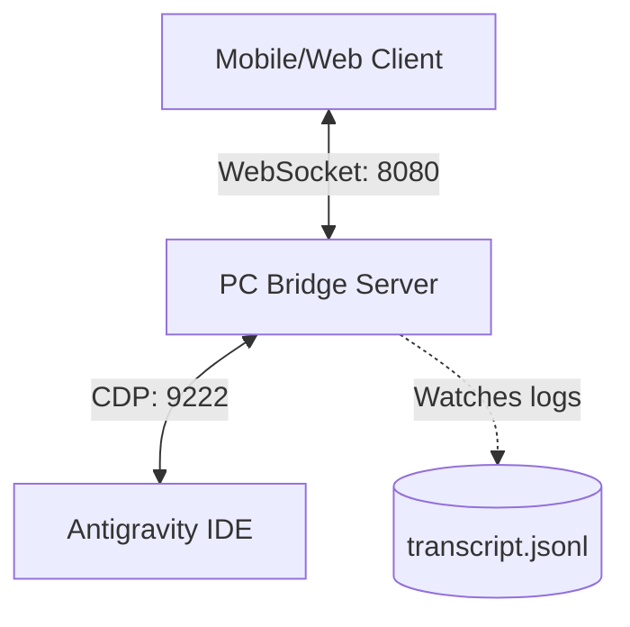

# purpose.md

## Project Goal
Allow the user to completely control the Antigravity IDE chat UI directly from their mobile phone or web browser in real-time. This provides an "AnyDesk-like" experience focused exclusively on interacting with the agentic chat interface.

## Core Features
1. **Real-time Input Sync**: Typing in the remote controller immediately types in the IDE chatbox.
2. **Native Simulation**: Uses native OS-level keyboard typing and coordinate-based mouse clicks to bypass DOM restrictions (such as Trusted Types) and trigger React synthetic event handlers.
3. **Live Chat Feed**: Streams the active conversation history and incoming updates (including tool executions and logs) directly to the phone/browser.
4. **Model Selection**: Allows remote switching of AI models.
5. **Session Management**: Remote trigger to start new chats.

## Architecture

* **Client**: React Native (Expo) web/mobile app simulating a dark-themed VS Code/Antigravity chat panel.
* **PC Bridge**: Node.js server connecting to the IDE's remote debugging port (`9222`) via Puppeteer-core, watching log files with Chokidar, and bridging actions via WebSockets.
